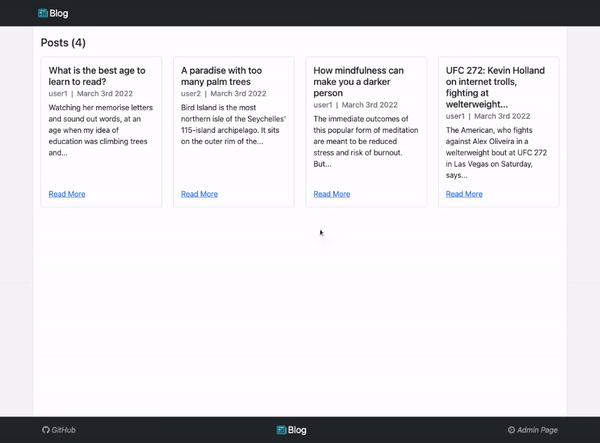

# Blog API Client
> A react front-end for a blog web application built using the MERN stack. Live demo [here](https://yamakenth.github.io/blog-api-client/).
## General Information
- This is one of two front-end apps served by a back-end
  - Visit the client(admin) front-end repository of this project [here](https://github.com/yamakenth/blog-api-client-admin)
  - Vist the back-end repository of this project [here](https://github.com/yamakenth/blog-api-server)
## Screen Capture

## Features
- Displays the list of all published blog posts on the homepage
- Shows details(title, author, published date, blog content, and comments) of each blog post when users click to read more
- Enables users to leave comments on posts where a comment consists of a username of the author(manual entry) and comment content
## Technologies Ued
- HTML
- CSS
- Bootstrap
- JavaScript
- React.js